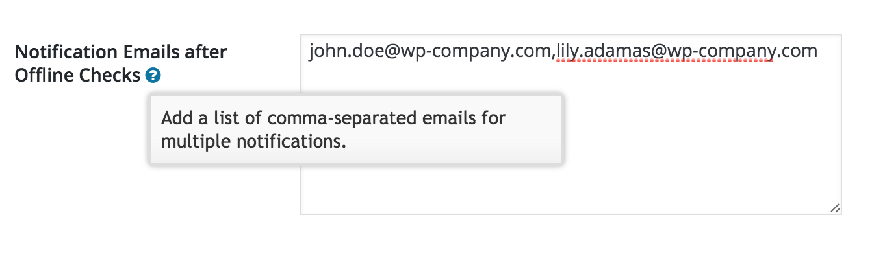

<!-- DO NOT EDIT THIS FILE; it is auto-generated from readme.txt -->
# MainWP Multiple Email Notifications

MainWP Multiple Email Notifications is a MainWP extension which lets user send emails to multiple recipients for auto updated of child sites.

**Contributors:** [desaiuditd](https://profiles.wordpress.org/desaiuditd)  
**Tags:** [mainwp](https://wordpress.org/plugins/tags/mainwp), [emails](https://wordpress.org/plugins/tags/emails), [notifications](https://wordpress.org/plugins/tags/notifications), [auto updates](https://wordpress.org/plugins/tags/auto updates)  
**Requires at least:** 3.6  
**Tested up to:** 4.2  
**Stable tag:** master  
**License:** [GPLv2 or later](http://www.gnu.org/licenses/gpl-2.0.html)  
**Donate Link:** Paypal ID : desaiuditd@gmail.com  

 

## Description ##

This plugin allows you to trigger multiple emails to recipients after the daily auto-updates are performed. This is specific to each site in MainWP.

**Important Links**

* [GitHub](https://github.com/moxienyc/mainwp-multiple-email-notifications/) - Please mention your wordpress.org username when sending pull requests.

## Installation ##

* Install the plugin from the 'Plugins' section in your dashboard (Go to `Plugins > Add New > Search` and search for MainWP Multiple Email Notifications).
* Alternatively, you can [download](http://downloads.wordpress.org/plugin/mainwp-multiple-email-notifications.zip "Download") the plugin from the repository. Unzip it and upload it to the plugins folder of your WordPress installation (`wp-content/plugins/` directory of your WordPress installation).
* Activate it through the 'Plugins' section.

## Frequently Asked Questions ##

Coming Soon!

## Screenshots ##

### Multiple Emails Settings Field

## Changelog ##

### 0.1 July 27, 2015 ###
* Plugin Scaffolding
* Basic Functionality
* Travis Setup

## Upgrade Notice ##

None.

